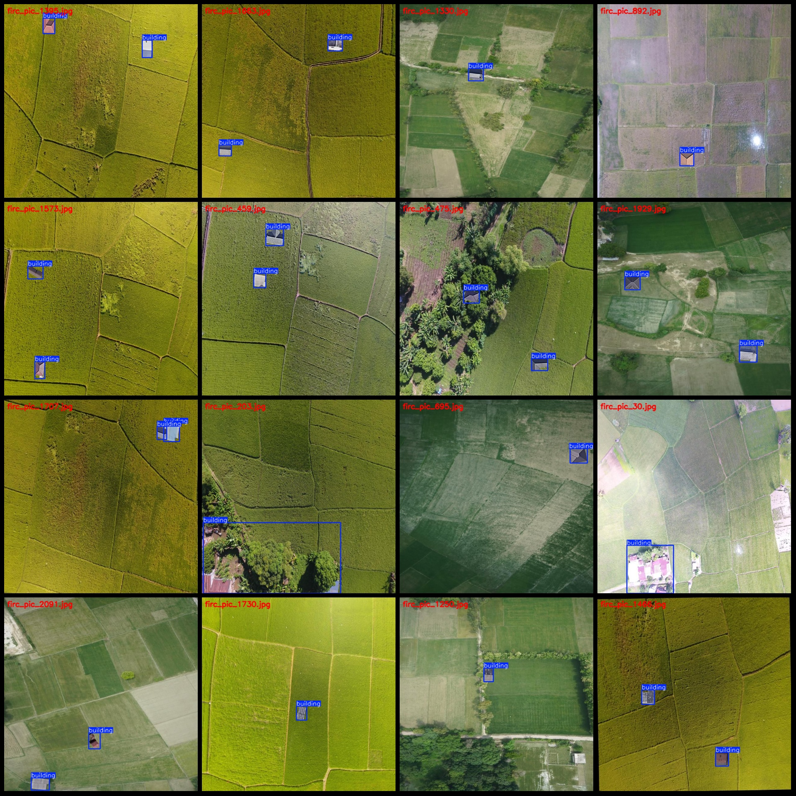
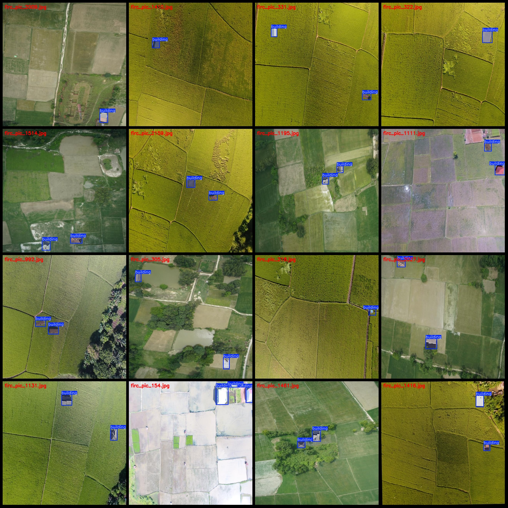

# Drone Viewpoint Aerial Photography of Irregular Farmland Illegal Constructions and House Building Detection Data Set (VOC+YOLO Format) - 2249 Images in 1 Category

Dataset Format: Pascal VOC format + YOLO format (without split path txt files, only containing jpg images along with corresponding VOC format xml files and YOLO format txt files)
Number of Images (jpg file count): 2249
Number of Annotations (xml file count): 2249
Number of Annotations (txt file count): 2249
Number of Annotation Categories: 1
Annotation Category Name: ["building"]
Number of Boxes per Category:
- building boxes = 3456
Total Boxes: 3456
Number of Images Each Category Occupies:
- building images = 2249
Image Resolution: 640x640
Using Annotation Tool: labelImg
Annotation Rules: Drawing rectangular boxes for categories
Important Notice: The dataset does not have separate training, validation, or test sets to be divided.
Special Remark: This dataset does not guarantee the accuracy of the trained models or weight files.
Image Preview:
Annotation Example:

## Images

Here is a pay link on Stripe ( https://buy.stripe.com/3cs8yP7sY87d0vu9AB ). Please contact me lonlonago@foxmail.com after funding $89, and I will send you a complete data files , thank you!

